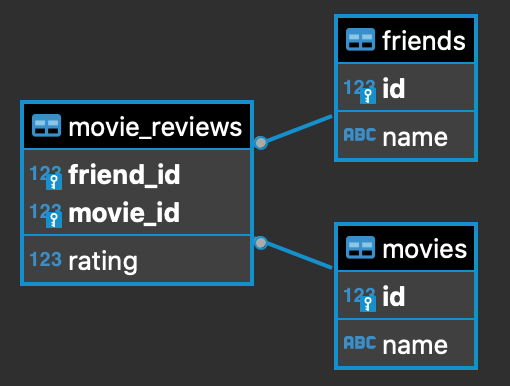

#Introduction
This exercise involves surveying classmate, and invisible friends about their movie preferences. We selected 6 current releases and conducted a open ended poll on slack and a poll of my imaginary friends. 


#Approach
Given the open-ended nature of this assignment I chose to approach it using the following methodology.


```{r load-packages, message=FALSE}

library(tidyverse)
library(openintro)
library(dplyr)
library(RMySQL)
library(ggplot2)

```


**1. Survey -** use 2 approaches to survey classmates and friends on movie ratings. The data was exists in a mysql database with the following structure


**2. Create Database -** designed the database schema and loaded the tables with meta data and survey data. included several database constraints to ensure cleaner data at the sources.




```{r eval=FALSE}


-- DATA606.friends definition

CREATE TABLE `friends` (
  `id` bigint NOT NULL AUTO_INCREMENT,
  `name` varchar(400) DEFAULT NULL,
  PRIMARY KEY (`id`)
) ENGINE=InnoDB AUTO_INCREMENT=12 DEFAULT CHARSET=utf8mb4 COLLATE=utf8mb4_0900_ai_ci;


-- DATA606.movies definition

CREATE TABLE `movies` (
  `id` bigint NOT NULL AUTO_INCREMENT,
  `name` varchar(400) DEFAULT NULL,
  PRIMARY KEY (`id`)
) ENGINE=InnoDB AUTO_INCREMENT=7 DEFAULT CHARSET=utf8mb4 COLLATE=utf8mb4_0900_ai_ci;


-- DATA606.movie_reviews definition

CREATE TABLE `movie_reviews` (
  `friend_id` bigint NOT NULL,
  `movie_id` bigint NOT NULL,
  `rating` bigint NOT NULL,
  PRIMARY KEY (`friend_id`,`movie_id`),
  KEY `movie_review_FK_1` (`movie_id`),
  CONSTRAINT `movie_review_FK` FOREIGN KEY (`friend_id`) REFERENCES `friends` (`id`),
  CONSTRAINT `movie_review_FK_1` FOREIGN KEY (`movie_id`) REFERENCES `movies` (`id`)
) ENGINE=InnoDB DEFAULT CHARSET=utf8mb4 COLLATE=utf8mb4_0900_ai_ci;


```

```{r eval=FALSE}


-- DATA606.friends insert

INSERT INTO DATA606.friends (name) VALUES('Bob');
INSERT INTO DATA606.friends (name) VALUES('Sam');
INSERT INTO DATA606.friends (name) VALUES('Frank');
INSERT INTO DATA606.friends (name) VALUES('Ann');
INSERT INTO DATA606.friends (name) VALUES('Sue');
INSERT INTO DATA606.friends (name) VALUES('Candy');
INSERT INTO DATA606.friends (name) VALUES('David');
INSERT INTO DATA606.friends (name) VALUES('Jeff');
INSERT INTO DATA606.friends (name) VALUES('Cliff');
INSERT INTO DATA606.friends (name) VALUES('Preston');
INSERT INTO DATA606.friends (name) VALUES('Coffy');


-- DATA606.movies insert
INSERT INTO DATA606.movies (name) VALUES('No Time to Die');
INSERT INTO DATA606.movies (name) VALUES('Free Guy');
INSERT INTO DATA606.movies (name) VALUES('Respect');
INSERT INTO DATA606.movies (name) VALUES('The Suicide Squad');
INSERT INTO DATA606.movies (name) VALUES('Jungle Cruise');
INSERT INTO DATA606.movies (name) VALUES('F9: The Fast Saga');


-- DATA606.movie_reviews insert
INSERT INTO DATA606.movie_reviews (friend_id, movie_id, rating) VALUES(1, 1, 5);
INSERT INTO DATA606.movie_reviews (friend_id, movie_id, rating) VALUES(1, 2, 3);
INSERT INTO DATA606.movie_reviews (friend_id, movie_id, rating) VALUES(1, 3, 7);
INSERT INTO DATA606.movie_reviews (friend_id, movie_id, rating) VALUES(1, 4, 999);
INSERT INTO DATA606.movie_reviews (friend_id, movie_id, rating) VALUES(1, 5, 2);
INSERT INTO DATA606.movie_reviews (friend_id, movie_id, rating) VALUES(1, 6, 4);
INSERT INTO DATA606.movie_reviews (friend_id, movie_id, rating) VALUES(2, 1, 5);
INSERT INTO DATA606.movie_reviews (friend_id, movie_id, rating) VALUES(2, 2, 4);
INSERT INTO DATA606.movie_reviews (friend_id, movie_id, rating) VALUES(2, 3, 2);
INSERT INTO DATA606.movie_reviews (friend_id, movie_id, rating) VALUES(2, 4, 5);
INSERT INTO DATA606.movie_reviews (friend_id, movie_id, rating) VALUES(2, 5, 2);
INSERT INTO DATA606.movie_reviews (friend_id, movie_id, rating) VALUES(2, 6, 4);
INSERT INTO DATA606.movie_reviews (friend_id, movie_id, rating) VALUES(3, 1, 4);
INSERT INTO DATA606.movie_reviews (friend_id, movie_id, rating) VALUES(3, 2, 1);
INSERT INTO DATA606.movie_reviews (friend_id, movie_id, rating) VALUES(3, 3, 2);
INSERT INTO DATA606.movie_reviews (friend_id, movie_id, rating) VALUES(3, 4, 1);
INSERT INTO DATA606.movie_reviews (friend_id, movie_id, rating) VALUES(3, 5, 2);
INSERT INTO DATA606.movie_reviews (friend_id, movie_id, rating) VALUES(3, 6, 2);
INSERT INTO DATA606.movie_reviews (friend_id, movie_id, rating) VALUES(4, 1, 4);
INSERT INTO DATA606.movie_reviews (friend_id, movie_id, rating) VALUES(4, 2, 6);
INSERT INTO DATA606.movie_reviews (friend_id, movie_id, rating) VALUES(4, 3, 2);
INSERT INTO DATA606.movie_reviews (friend_id, movie_id, rating) VALUES(4, 4, 1);
INSERT INTO DATA606.movie_reviews (friend_id, movie_id, rating) VALUES(4, 5, 4);
INSERT INTO DATA606.movie_reviews (friend_id, movie_id, rating) VALUES(4, 6, 1);
INSERT INTO DATA606.movie_reviews (friend_id, movie_id, rating) VALUES(5, 1, 5);
INSERT INTO DATA606.movie_reviews (friend_id, movie_id, rating) VALUES(5, 2, 5);
INSERT INTO DATA606.movie_reviews (friend_id, movie_id, rating) VALUES(5, 3, 2);
INSERT INTO DATA606.movie_reviews (friend_id, movie_id, rating) VALUES(5, 4, 3);
INSERT INTO DATA606.movie_reviews (friend_id, movie_id, rating) VALUES(5, 5, 1);
INSERT INTO DATA606.movie_reviews (friend_id, movie_id, rating) VALUES(5, 6, 1);
INSERT INTO DATA606.movie_reviews (friend_id, movie_id, rating) VALUES(6, 1, 5);
INSERT INTO DATA606.movie_reviews (friend_id, movie_id, rating) VALUES(6, 2, 5);
INSERT INTO DATA606.movie_reviews (friend_id, movie_id, rating) VALUES(6, 3, 2);
INSERT INTO DATA606.movie_reviews (friend_id, movie_id, rating) VALUES(6, 4, 3);
INSERT INTO DATA606.movie_reviews (friend_id, movie_id, rating) VALUES(6, 5, 1);
INSERT INTO DATA606.movie_reviews (friend_id, movie_id, rating) VALUES(6, 6, 1);
INSERT INTO DATA606.movie_reviews (friend_id, movie_id, rating) VALUES(7, 1, 5);
INSERT INTO DATA606.movie_reviews (friend_id, movie_id, rating) VALUES(8, 1, 2);
INSERT INTO DATA606.movie_reviews (friend_id, movie_id, rating) VALUES(9, 1, 0);
INSERT INTO DATA606.movie_reviews (friend_id, movie_id, rating) VALUES(10, 1, 0);
INSERT INTO DATA606.movie_reviews (friend_id, movie_id, rating) VALUES(11, 1, 0);

```


**3. Read Data -** This was a small dataset so I read the data directly into an R dataframe
```{r read data from sql}

#####
#
# load data
#
#####

mydb = dbConnect(MySQL(), user='root', password='AllAcd1234', dbname='DATA606', host='localhost')

rs = dbSendQuery(mydb, "select * 
            from DATA606.movie_reviews
            Join DATA606.friends 
            	on friends.id = movie_reviews.friend_id
            Join DATA606.movies
            	on movies.id = movie_reviews.movie_id")

data = fetch(rs, n=-1)
dbDisconnect(mydb)


```


**4. Cleaned Data -** Removed all invalid rows not filtered by the database constraints. 

```{r read data from sql}


#####
#
# clean data
#
#####

clean_data <- subset(data, data$rating > 0 & data$rating < 6) 


#####
#
# calculate average
#
#####
avg <- aggregate(clean_data$rating, list(clean_data$movie_id), FUN=mean) 
names(avg)[1] <- "movie_id"
names(avg)[2] <- "avg_rating"
avg


#####
#
# build final dataframe
#
#####
clean_data <- subset(clean_data, , select=c(movie_id, name.1))

clean_data <- unique(clean_data)
clean_data

avg <- merge(avg,clean_data,by="movie_id")
names(avg)[3] <- "movie_name"
avg


```


**5. Graph Results -** Graph the average results from the survey 

```{r read data from sql}

ggplot(data=avg, aes(x=movie_name, y=avg_rating)) + geom_bar(stat="identity") + coord_flip()

```


#Conclusion
In this very unscientific survey "No Time to Loose" received the highest ratings. We did not see equal numbers of responses for each record.


